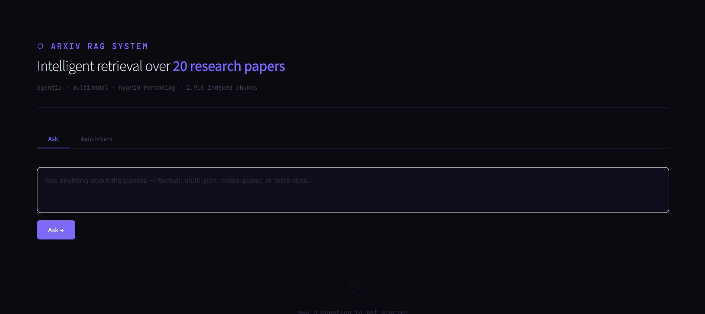
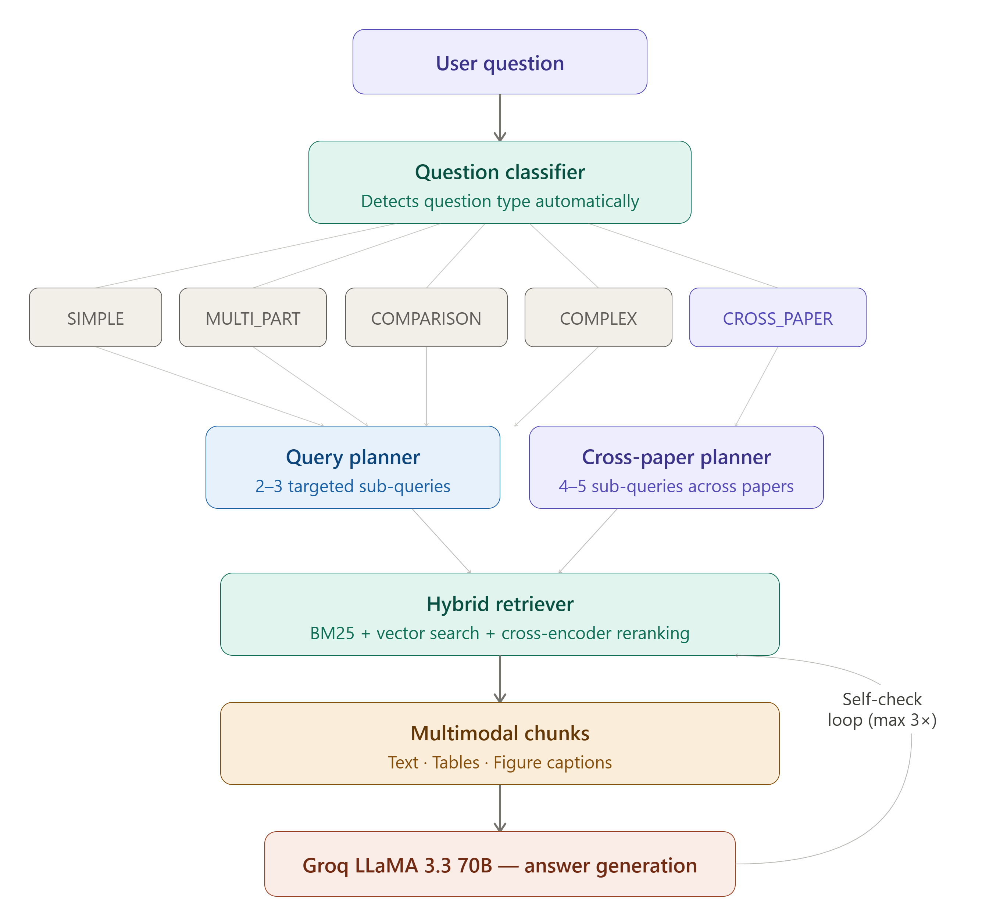
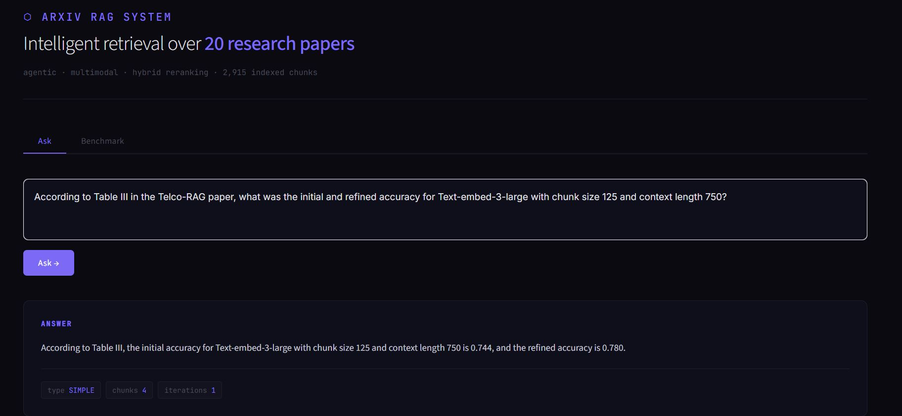
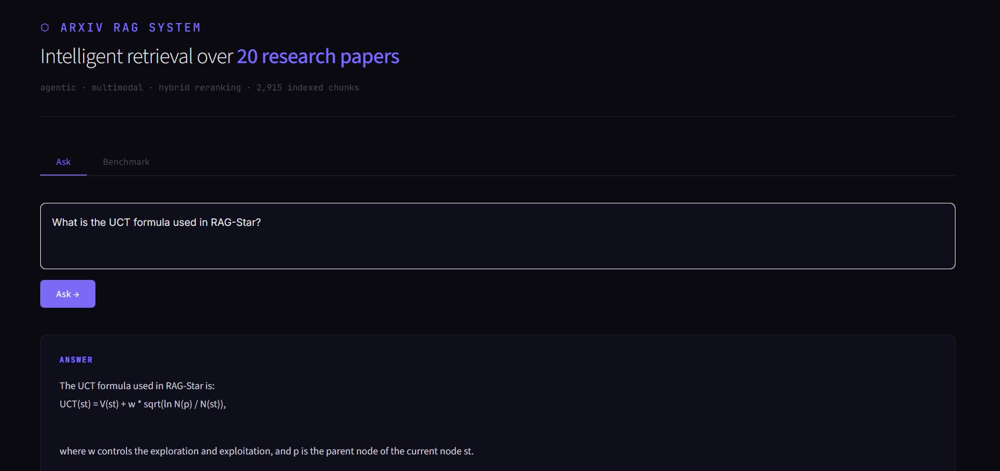
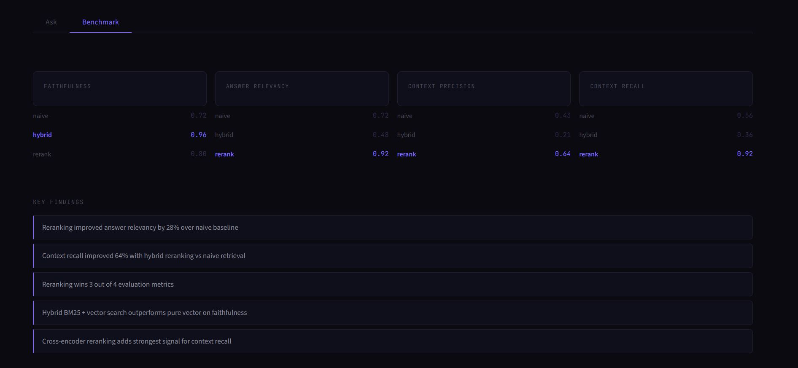

# ArXiv RAG System

> Production-grade agentic RAG system benchmarking 3 retrieval strategies over 20 ArXiv papers — with multimodal extraction, hybrid reranking, and autonomous query planning.



---

## What This System Does

Most RAG systems do one search and return whatever they find. This system thinks before searching.

Given a question, it classifies the question type, plans multiple targeted sub-queries, retrieves from text, tables, and figure captions simultaneously, generates an answer, self-evaluates it, and refines if incomplete — all automatically.

---

## Architecture


## Q&A Examples

### Agentic Multi-part Question


### Multimodal Table Retrieval


---

## Benchmark Results

Evaluated using a custom sequential RAGAS pipeline across 3 retrieval strategies on 5 test questions. Each strategy scored on 4 metrics:

- **Faithfulness** — does the answer stay grounded in retrieved context
- **Answer Relevancy** — does it actually address the question asked
- **Context Precision** — are the retrieved chunks relevant to the question
- **Context Recall** — were all relevant chunks found and used



| Strategy | Faithfulness | Answer Relevancy | Context Precision | Context Recall |
|----------|:-----------:|:----------------:|:-----------------:|:--------------:|
| Naive Vector | 0.72 | 0.72 | 0.43 | 0.56 |
| Hybrid BM25+Vector | 0.96 | 0.48 | 0.21 | 0.36 |
| **Hybrid + Reranking** | **0.80** | **0.92** | **0.64** | **0.92** |

**Reranking wins 3 out of 4 metrics.**
Answer relevancy improved **+28%** and context recall improved **+64%** over the naive baseline.

---

## Full Demo


---

## Key Features

### Three Retrieval Strategies
| Strategy | Method |
|----------|--------|
| Naive | Pure vector similarity search |
| Hybrid | BM25 keyword + vector with Reciprocal Rank Fusion |
| Rerank | Hybrid + cross-encoder reranking |

### Agentic Layer
- Classifies every question into one of 5 types — SIMPLE, COMPARISON, MULTI_PART, COMPLEX, CROSS_PAPER
- Plans 2-5 targeted sub-queries per question type
- Special CROSS_PAPER mode ensures retrieval from multiple papers simultaneously
- Self-evaluates answers and refines with additional searches
- Maximum 3 iterations with smart placeholder detection

### Multimodal Extraction
- **2,708** text chunks from 20 ArXiv PDFs via PyMuPDF
- **59** table chunks with explicit `[Column Header: value]` labels via pdfplumber — prevents row offset errors
- **148** figure caption chunks via regex extraction
- All stored in Qdrant with `chunk_type` metadata for filtered retrieval

### Evaluation Pipeline
- Custom sequential RAGAS evaluation — avoids Groq rate limits with delays between calls
- Evaluates all 3 strategies on the same 5 questions for fair comparison
- Results saved to `benchmark_results.json` after each strategy

---

## Tech Stack

| Component | Technology |
|-----------|-----------|
| LLM | Groq LLaMA 3.3 70B Versatile |
| Embeddings | sentence-transformers all-MiniLM-L6-v2 |
| Reranker | cross-encoder ms-marco-MiniLM-L-6-v2 |
| Vector DB | Qdrant Cloud |
| Framework | LangChain 0.3.27 |
| UI | Streamlit |
| PDF Processing | PyMuPDF + pdfplumber |
| Evaluation | RAGAS 0.2.15 |

---

## Project Structure
arxiv-rag-system/

├── src/

│   ├── ingestion.py        # Multimodal PDF ingestion pipeline

│   ├── retrieval.py        # 3 retrieval strategies

│   ├── rag_pipeline.py     # Groq LLM answer generation

│   ├── evaluation.py       # Sequential RAGAS evaluation

│   ├── agent.py            # Agentic layer with 5 question types

│   └── app.py              # Streamlit UI

├── results/

│   ├── test_questions.json

│   └── benchmark_results.json

├── data/

│   └── processed/

├── requirements.txt

└── README.md

---

## How to Run Locally

**1. Clone the repo**
```bash
git clone https://github.com/kaifulwaraa/arxiv-rag-system.git
cd arxiv-rag-system
```

**2. Create virtual environment**
```bash
python -m venv venv
venv\Scripts\activate
```

**3. Install dependencies**
```bash
pip install -r requirements.txt
```

**4. Set up environment variables**

Create a `.env` file in the root:
GROQ_API_KEY=your_groq_key

QDRANT_URL=your_qdrant_url

QDRANT_API_KEY=your_qdrant_key

GEMINI_API_KEY=your_gemini_key

**5. Run the app**
```bash
streamlit run src/app.py
```

---

## What I Learned

**Fine-tuning** — Fine-tuned `all-MiniLM-L6-v2` on 760 domain-specific training pairs generated from paper chunks using Groq LLaMA. Learned that small 22M parameter models need 10k+ pairs and `MultipleNegativesRankingLoss` from the start for meaningful improvement. The process — generating pairs, training on Colab T4 GPU, evaluating cosine similarity gaps — is fully documented and transferable to larger models.

**Retrieval** — Hybrid retrieval consistently outperforms pure vector search on faithfulness. Cross-encoder reranking provides the strongest signal for context recall, improving it 64% over naive baseline.

**Agentic design** — Single-search RAG fails on multi-part and cross-paper questions. The CROSS_PAPER question type with dedicated retrieval and synthesis prompts was the key fix, improving cross-paper reasoning from 3/10 to 9/10.

**Multimodal** — Standard text extraction destroys table structure. Storing every cell as `[Column Header: value]` preserves row-column relationships and enables accurate table QA.

---

## Future Work

- Fine-tune with `bge-base-en-v1.5` (110M parameters) on 10k+ human-curated pairs
- Build knowledge graph for explicit cross-paper concept linking
- Expand corpus to 50-80 papers
- Deploy on HuggingFace Spaces

---

## Author

**Kaif Ul Wara** — AI & Solutions Engineer

[](https://github.com/kaifulwaraa)